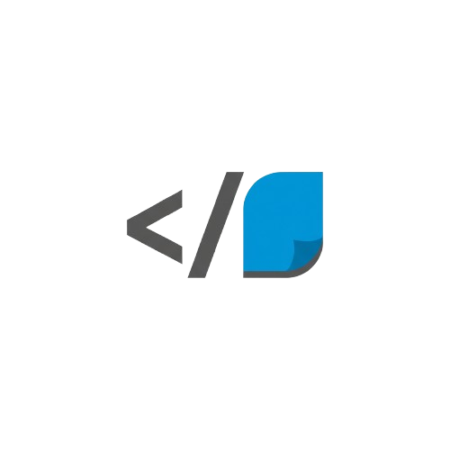

<div align="center">
  
  <h1>Klaro</h1>
  <strong>From Code to Clarity. Instantly.</strong>
</div>
<br />
<p align="center">
  <a href="https://github.com/aethrox/klaro/actions/workflows/main.yml"></a>
  <a href="./LICENSE"></a>
  <a href="#"></a>
  <a href="#"></a>
</p>

---

## 📖 Table of Contents

- [Overview & Value Proposition](#-overview--value-proposition)
- [Architectural Deep Dive](#-architectural-deep-dive)
- [Setup & Installation](#-setup--installation)
- [Usage & Expected Behavior](#-usage--expected-behavior)
- [Future Roadmap & Contributions](#-future-roadmap--contributions)
- [License](#-license)

---

## 🎯 Overview & Value Proposition

### The Mission

**Klaro** is an **autonomous AI agent** designed to solve one of software engineering's most persistent challenges: **neglected technical documentation**. Moving complex codebases from chaos to clarity, Klaro autonomously analyzes your project and generates high-quality, professional documentation with minimal human intervention.

**Slogan:** *"From Code to Clarity. Instantly."*

### The Problem

Technical documentation is often the first casualty of rapid development cycles:
- **Time-Consuming:** Writing docs manually diverts valuable engineering time from feature development
- **Inconsistent Quality:** Different team members produce documentation with varying levels of detail and style
- **Quickly Outdated:** Code evolves faster than documentation can be updated
- **Onboarding Friction:** New team members struggle with undocumented or poorly documented codebases
- **Technical Debt:** Accumulation of undocumented systems creates long-term maintenance burdens

### Why Klaro is Unique

Unlike simple template-based generators or naive LLM wrappers, Klaro combines **three advanced technical capabilities** that set it apart:

#### 1. **AST-Powered Semantic Analysis**
Klaro doesn't just read code as text—it **understands code structure**. Using Python's **Abstract Syntax Tree (AST)**, Klaro performs deep structural analysis:
- Extracts classes, functions, methods, and their relationships
- Captures type annotations, parameters, and return types
- Preserves docstrings and structural metadata
- Outputs structured JSON for semantic comprehension

**Why this matters:** AST analysis goes beyond surface-level pattern matching, enabling Klaro to understand *what your code does*, not just *what it looks like*.

#### 2. **RAG-Based Quality Assurance**
Klaro integrates a **Retrieval-Augmented Generation (RAG)** system using ChromaDB and OpenAI Embeddings to enforce documentation standards:
- Learns from your existing style guides and documentation standards
- Retrieves relevant style context during generation
- Ensures consistency in tone, structure, and formatting
- Maintains professional quality across all generated docs

**Why this matters:** Documentation isn't just about *content*—it's about *consistency*. RAG ensures every README follows your project's standards.

#### 3. **LangGraph State Machine Architecture**
Klaro uses **LangGraph**—not simple prompt chains or unstable agent loops—for robust, stateful orchestration:
- **Stateful Error Recovery:** Tracks execution state and recovers from tool failures gracefully
- **Complex Workflow Orchestration:** Manages multi-step reasoning and tool calling with explicit state transitions
- **Deterministic Execution:** Predictable behavior through well-defined graph nodes and edges

**Why this matters:** Production-grade agents require robust error handling and state management—LangGraph provides the architectural foundation for reliability.

---

## 🏗 Architectural Deep Dive

### The Evolution: From ReAct to LangGraph

Klaro underwent a critical architectural evolution to achieve production-grade reliability:

| Iteration | Architecture | Issues |
|-----------|-------------|--------|
| **Stage 1-2** | Pure Python ReAct Loop | Manual state management, fragile error handling |
| **Stage 3** | LangChain AgentExecutor | Unstable, poor error recovery, black-box behavior |
| **Stage 4 (Current)** | **LangGraph State Machine** | ✅ Stateful, robust, transparent, production-ready |

**Rationale for LangGraph Migration:**
- **Stateful Agent Design:** Maintains conversation history, error logs, and execution context across tool calls
- **Explicit Control Flow:** Nodes (`run_model`, `call_tool`) and conditional edges provide transparent execution logic
- **Error Resilience:** Failed tool calls route back to the model for replanning instead of crashing
- **Scalability:** Foundation for future enhancements like multi-model routing and parallel tool execution

### LangGraph State Machine Flow

```
┌─────────────────────────────────────────────────────────────┐
│                    User Input (Task)                        │
└────────────────────┬────────────────────────────────────────┘
                     │
                     ▼
         ┌───────────────────────┐
         │   Initialize RAG DB   │ ← Load style guides into ChromaDB
         └───────────┬───────────┘
                     │
                     ▼
         ┌───────────────────────┐
         │    run_model Node     │ ← LLM reasoning step (GPT-4o mini)
         └───────────┬───────────┘
                     │
                     ▼
         ┌───────────────────────┐
         │  decide_next_step     │ ← Router: Tool call? Final answer? Error?
         └─┬─────────┬─────────┬─┘
           │         │         │
      Tool │    Final│    Error│
      Call │   Answer│         │
           │         │         │
           ▼         ▼         ▼
    ┌──────────┐  ┌────┐  ┌────────┐
    │call_tool │  │END │  │Replan  │
    └────┬─────┘  └────┘  └───┬────┘
         │                     │
         └─────────────────────┘
                  │
                  ▼
         ┌───────────────────────┐
         │   Tool Observation    │ ← Results from list_files, analyze_code, etc.
         └───────────┬───────────┘
                     │
                     └──────► (Loop back to run_model)
```

**Key Nodes:**
- **`run_model`:** Invokes the LLM (GPT-4o mini) with full message history
- **`call_tool`:** Executes requested tools via `ToolNode` (delegated execution)
- **Router Logic:** Conditional edges based on LLM output (tool calls, final answer, errors)

**State Definition (TypedDict):**
```python
class AgentState(TypedDict):
    messages: Annotated[Sequence[BaseMessage], lambda x, y: x + y]  # Conversation history
    error_log: str  # Error tracking for recovery
```

### Core Tools & Their Role

Klaro provides **5 specialized tools** to the LLM agent:

| Tool | Purpose | Technical Details |
|------|---------|------------------|
| **`list_files`** | Directory tree exploration | Recursively lists files, respects `.gitignore` patterns |
| **`read_file`** | File content retrieval | UTF-8 encoding, error handling for missing files |
| **`analyze_code`** | Structural code analysis | Python AST parser → JSON (classes, functions, docstrings, type hints) |
| **`web_search`** | External knowledge retrieval | Simulated search (placeholder for future API integration) |
| **`retrieve_knowledge`** | RAG-based style guide lookup | ChromaDB vector search → top-3 relevant style guide chunks |

**Critical Workflow Requirement:**
The agent **MUST** call `retrieve_knowledge` to fetch style guidelines before generating the final documentation. This ensures all outputs adhere to project standards.

### Deep Dive: AST-Based Code Analysis

**Why AST over Regex or Text Parsing?**

```python
# Example: Analyzing this function
def calculate_metrics(data: List[Dict], threshold: float = 0.5) -> Tuple[int, float]:
    """Calculates performance metrics from data."""
    # ... implementation
```

**AST Output (analyze_code):**
```json
{
  "type": "function",
  "name": "calculate_metrics",
  "parameters": ["data", "threshold"],
  "returns": "Tuple[int, float]",
  "docstring": "Calculates performance metrics from data.",
  "lineno": 42
}
```

**Advantages:**
- **Type-Aware:** Preserves type annotations (`List[Dict]`, `Tuple[int, float]`)
- **Semantic Understanding:** Knows the difference between function calls and definitions
- **Robust Parsing:** Python's built-in `ast` module handles all valid Python syntax
- **Structured Output:** JSON format enables downstream LLM reasoning

### Deep Dive: RAG for Style Consistency

**The Challenge:** Without guidance, LLMs produce inconsistent documentation styles.

**Klaro's Solution:**

1. **Indexing Phase (init_knowledge_base):**
   ```python
   # Style guide document
   guide = "All README.md files must include: # Project Name, ## Setup, ## Usage..."

   # Chunking + Embedding + Storage
   text_splitter.split_documents([guide])  # Chunk size: 1000, overlap: 200
   embeddings = OpenAIEmbeddings(model="text-embedding-3-small")
   vectorstore = Chroma.from_documents(texts, embeddings, persist_directory="./klaro_db")
   ```

2. **Retrieval Phase (retrieve_knowledge):**
   ```python
   # Agent query: "What are the README style guidelines?"
   retriever.invoke(query)  # Returns top-3 most relevant chunks
   # → LLM receives style context BEFORE writing final answer
   ```

**Why ChromaDB?**
- **Local-First:** No external dependencies, persisted to `./klaro_db/`
- **Efficient:** Vector similarity search with OpenAI embeddings
- **Scalable:** Can index large style guide corpora (future: multiple projects)

---

## 🚀 Setup & Installation

### Prerequisites

- **Python 3.11 or higher** (required for modern type hints and AST features)
- **OpenAI API Key** ([Get one here](https://platform.openai.com/api-keys))
- **Git** (for cloning the repository)

### Primary Dependencies

Klaro relies on the following core technologies:

| Package | Version | Purpose |
|---------|---------|---------|
| `langchain` | 1.0.2 | Tool abstractions and prompts |
| `langchain-openai` | 1.0.1 | GPT-4o mini integration |
| `langgraph` | 1.0.1 | State machine orchestration |
| `chromadb` | 1.2.1 | Vector database for RAG |
| `python-dotenv` | 1.1.1 | Environment variable management |

**Full dependency list:** See [`requirements.txt`](requirements.txt) (120+ packages including transitive dependencies).

### Installation Steps

#### 1. Clone the Repository

```bash
git clone https://github.com/aethrox/klaro.git
cd klaro
```

#### 2. Create a Virtual Environment (Recommended)

```bash
# Using venv (Python 3.11+)
python3.11 -m venv klaro-env
source klaro-env/bin/activate  # On Windows: klaro-env\Scripts\activate

# Or using conda
conda create -n klaro python=3.11
conda activate klaro
```

#### 3. Install Dependencies

```bash
pip install -r requirements.txt
```

**Note:** Installation may take 2-5 minutes due to heavy dependencies (ChromaDB, LangChain ecosystem).

**Troubleshooting:** If you encounter the `distro` version conflict with `conan`, this is expected and non-breaking (warning only).

#### 4. Configure Environment Variables

Create a `.env` file in the project root:

```bash
cp .env.example .env
```

Edit `.env` and add your OpenAI API key:

```bash
# .env
OPENAI_API_KEY=sk-proj-xxxxxxxxxxxxxxxxxxxxxxxxxxxxxx

# Optional: Override recursion limit (default: 50)
# KLARO_RECURSION_LIMIT=50
```

**Security Note:** Never commit your `.env` file to version control. It's already in `.gitignore`.

#### 5. Verify Installation

```bash
# Test imports
python -c "import langchain, langgraph, chromadb; print('✅ All dependencies loaded')"

# Test module imports
python -c "from tools import analyze_code; from prompts import SYSTEM_PROMPT; print('✅ Klaro modules OK')"
```

---

## 📚 Usage & Expected Behavior

### Running Klaro

Execute the main script to analyze the current directory:

```bash
python main.py
```

**What Klaro Does:**

1. **Initializes RAG Knowledge Base:**
   ```
   📢 Initializing RAG Knowledge Base...
      -> Setup Result: Knowledge base (ChromaDB) successfully initialized at ./klaro_db. 1 chunks indexed.
   ```

2. **Enters LangGraph Agent Loop:**
   - **Step 1:** LLM receives system prompt + user task
   - **Step 2:** Agent calls `list_files` to explore project structure
   - **Step 3:** Agent calls `read_file` on critical files (e.g., `main.py`, `tools.py`, `requirements.txt`)
   - **Step 4:** Agent calls `analyze_code` on Python files for AST analysis
   - **Step 5:** Agent calls `retrieve_knowledge` to fetch README style guidelines
   - **Step 6:** Agent synthesizes findings into final README.md content

3. **Outputs Final Documentation:**
   ```
   ==================================================
   ✅ TASK SUCCESS: LangGraph Agent Finished.
   ====================================

   # Klaro
   ## Setup
   ...
   ```

### Expected Agent Flow (ReAct Pattern)

The agent follows a **Thought → Action → Observation** loop:

```
Thought: I need to explore the project structure first.
Action: list_files[.]
Observation: (File tree output)

Thought: I should read the main entry point.
Action: read_file[main.py]
Observation: (File content)

Thought: This Python file needs structural analysis.
Action: analyze_code[<content>]
Observation: {"analysis_summary": "2 classes, 5 functions", "components": [...]}

Thought: I need to check the documentation style guidelines.
Action: retrieve_knowledge["README style guidelines"]
Observation: Retrieved Information:
Source 1: All README.md documents must include # Project Name, ## Setup...

Thought: I have enough information to generate the README.
Final Answer: # Project Name...
```

### Customization Options

#### Adjust Recursion Limit

Modify the maximum number of agent iterations:

```bash
# In .env
KLARO_RECURSION_LIMIT=100  # Default: 50
```

#### Modify Style Guides

Edit the style guide content in `main.py` (lines 113-119):

```python
DEFAULT_GUIDE_CONTENT = """
# Your Custom Documentation Style Guide:
1. All sections must use sentence case
2. Code examples must include type hints
...
"""
```

**Future Enhancement:** Load style guides from external files (Markdown, JSON).

#### Change Target Directory

Modify the `run_klaro_langgraph()` call in `main.py` (line 173):

```python
if __name__ == "__main__":
    run_klaro_langgraph(project_path="./path/to/your/project")
```

### Performance Considerations

| Metric | Typical Value |
|--------|---------------|
| **Agent Iterations** | 8-15 (depends on project complexity) |
| **API Calls (GPT-4o mini)** | 10-20 (includes tool calls + model invocations) |
| **Execution Time** | 15-60 seconds (depends on codebase size) |
| **Cost per Run** | ~$0.02-0.10 USD (GPT-4o mini pricing) |

**Cost Optimization:** Future versions will implement smart model steering (use GPT-4o mini for simple tasks, GPT-4o for complex analysis).

---

## 🛠 Future Roadmap & Contributions

### Planned Features (From Original Project Plan)

#### 1. **Smart Model Steering** (High Priority)
**Goal:** Optimize API costs by routing tasks to appropriate models.

**Implementation:**
- **Low-Complexity Tasks** (file listing, basic parsing) → GPT-4o mini
- **High-Complexity Tasks** (architecture analysis, design decisions) → GPT-4o / Claude Sonnet 3.5
- **Routing Logic:** Use LangGraph conditional edges based on task classification

**Expected Impact:** 40-60% cost reduction for large codebases.

**Reference:** See original design doc (`klaro_tools_and_costs`) for detailed cost analysis.

#### 2. **Multi-Format Output** (Medium Priority)
Expand beyond README.md to generate:
- **API Reference Docs** (Swagger/OpenAPI specs)
- **Architecture Diagrams** (Mermaid.js, PlantUML)
- **Changelog Generation** (from git commit history)
- **Inline Code Comments** (docstring augmentation)

#### 3. **Multi-Language Support** (Long-Term)
Extend AST analysis beyond Python:
- **JavaScript/TypeScript:** Using Babel/TypeScript Compiler API
- **Go:** Using `go/ast` package
- **Rust:** Using `syn` crate
- **Java:** Using JavaParser

#### 4. **Interactive CLI/Web Interface** (Medium Priority)
- **CLI Enhancements:** Progress bars, interactive prompts for style guide selection
- **Web Dashboard:** FastAPI + React frontend for non-technical users
- **VSCode Extension:** Generate docs directly from editor

#### 5. **Advanced RAG Features** (Medium Priority)
- **Multi-Source Indexing:** Index existing project docs, StackOverflow answers, official library docs
- **Contextual Retrieval:** Use codebase-specific embeddings (fine-tuned on project history)
- **Style Guide Learning:** Automatically extract style patterns from existing docs

### How to Contribute

Klaro is **MIT-licensed** and welcomes community contributions!

#### Contribution Areas

| Area | Skills Needed | Impact |
|------|---------------|--------|
| **Core Agent Logic** | Python, LangChain, LangGraph | High |
| **Multi-Language AST Support** | Compiler design, language-specific parsers | High |
| **RAG System Enhancements** | Vector databases, embeddings, retrieval | Medium |
| **Documentation** | Technical writing | Medium |
| **Testing & QA** | Pytest, integration testing | High |
| **UI/UX** | React, FastAPI, CLI design | Medium |

#### Getting Started

1. **Fork the Repository**
   ```bash
   git clone https://github.com/YOUR_USERNAME/klaro.git
   cd klaro
   git checkout -b feature/your-feature-name
   ```

2. **Set Up Development Environment**
   ```bash
   pip install -r requirements.txt
   pip install pytest black ruff  # Dev dependencies
   ```

3. **Run Tests** (Future: Test suite under development)
   ```bash
   pytest tests/
   ```

4. **Submit a Pull Request**
   - Ensure code follows PEP 8 (use `black` for formatting)
   - Add docstrings for all new functions
   - Include tests for new features
   - Reference related issues in PR description

#### Communication Channels

- **GitHub Issues:** [Report bugs, request features](https://github.com/aethrox/klaro/issues)
- **Discussions:** [Ask questions, share ideas](https://github.com/aethrox/klaro/discussions)
- **Pull Requests:** [Contribute code](https://github.com/aethrox/klaro/pulls)

### Development Principles

Klaro follows these core principles:

1. **Reliability Over Speed:** Production-grade error handling is non-negotiable
2. **Transparency Over Magic:** Explicit state machines > black-box frameworks
3. **Quality Over Quantity:** RAG-enforced standards ensure consistent output
4. **Developer Experience:** Clear documentation, easy setup, minimal dependencies

---

## 📄 License

Klaro is licensed under the **MIT License**.

```
Copyright (c) 2025 Klaro Contributors

Permission is hereby granted, free of charge, to any person obtaining a copy
of this software and associated documentation files (the "Software"), to deal
in the Software without restriction, including without limitation the rights
to use, copy, modify, merge, publish, distribute, sublicense, and/or sell
copies of the Software, and to permit persons to whom the Software is
furnished to do so, subject to the following conditions:

The above copyright notice and this permission notice shall be included in all
copies or substantial portions of the Software.

THE SOFTWARE IS PROVIDED "AS IS", WITHOUT WARRANTY OF ANY KIND, EXPRESS OR
IMPLIED, INCLUDING BUT NOT LIMITED TO THE WARRANTIES OF MERCHANTABILITY,
FITNESS FOR A PARTICULAR PURPOSE AND NONINFRINGEMENT. IN NO EVENT SHALL THE
AUTHORS OR COPYRIGHT HOLDERS BE LIABLE FOR ANY CLAIM, DAMAGES OR OTHER
LIABILITY, WHETHER IN AN ACTION OF CONTRACT, TORT OR OTHERWISE, ARISING FROM,
OUT OF OR IN CONNECTION WITH THE SOFTWARE OR THE USE OR OTHER DEALINGS IN THE
SOFTWARE.
```

See the full license text in [`LICENSE`](./LICENSE).

---

## 📚 Additional Documentation

For in-depth technical details, refer to the project documentation in the `docs/` directory:

- **Project Roadmap:** Development stages and milestones
- **Technical Design:** Advanced agent architecture and tool design
- **Development Reports:** Stage-by-stage implementation notes
- **Cost Analysis:** API usage optimization strategies

---

<div align="center">
  <strong>Built with ❤️ by the Klaro community</strong>
  <br />
  <sub>Powered by LangGraph, OpenAI, and ChromaDB</sub>
</div>
