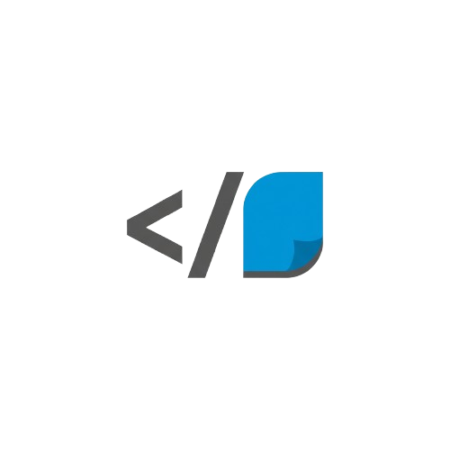

  
  <h1>Klaro</h1>
  <strong>From Code to Clarity. Instantly.</strong>

  
  
  

## Overview

`Klaro`, tüm kod tabanınızı otonom olarak okuyan, mantığını anlayan ve minimum insan müdahalesiyle net, profesyonel ve güncel teknik dokümantasyon (README'ler, API referansları ve geliştirici kılavuzları gibi) oluşturan bir yapay zeka ajanıdır.

### 💡 The Problem

Dokümantasyon yazmak ve güncel tutmak zaman alıcı, sıkıcı ve genellikle ihmal edilen bir iştir. Bu durum teknik borca, yavaş adaptasyon süreçlerine ve verimsizliğe yol açar.

### 🚀 The Solution

Klaro bu süreci tamamen otomatikleştirir. Deponuzun adresini verin ve o size yüksek kaliteli dokümantasyon teslim etsin. Bu sayede geliştiriciler asıl işlerine, yani harika ürünler geliştirmeye odaklanabilir.

## ✨ Features (Planned)

* **Otonom Kod Analizi:** Tüm dosya ağacını okur, kilit mantığı belirler ve bileşenler arasındaki ilişkileri anlar.
* **Çoklu Format Çıktısı:** Profesyonel Markdown (`README.md`), API referansları ve daha fazlasını üretir.
* **Yapay Zeka Destekli Anlama:** Kodun derinlemesine anlaşılması için LangChain ve LangGraph aracılığıyla en gelişmiş LLM'leri (GPT-4o mini, Claude 3.5 Sonnet vb.) kullanır.
* **Akıllı Model Yönlendirme:** Maliyeti optimize etmek için basit görevlerde (dosya listeleme) ucuz modelleri, karmaşık analizlerde (kod özetleme) güçlü modelleri kullanır.
* **Stil Kılavuzu Entegrasyonu (RAG):** (Aşama 3) Projenizin tonunu ve stilini eşleştirmek için mevcut dokümanlarınızdan öğrenir.

## 🛠 Technology Stack

* **Core:** Python 3.9+
* **AI Framework:** LangChain & LangGraph
* **Models:** GPT-4o mini, Claude 3.5 Sonnet, Claude 3 Haiku (Agentic Router ile)
* **Code Analysis:** `ast` (Abstract Syntax Tree), `GitPython`
* **Observability:** LangSmith

## 🚧 Status: Under Active Development

Bu proje şu anda aktif geliştirme aşamasındadır. Tam yol haritası için proje planlama belgelerine bakabilirsiniz.
*(Bu dokümanların da depoya eklenmesi önerilir.)*

* `klaro_project_plan.md`
* `klaro_tech_docs_guide.md`

## License

This project is licensed under the MIT License - see the [LICENSE](LICENSE) file for details.